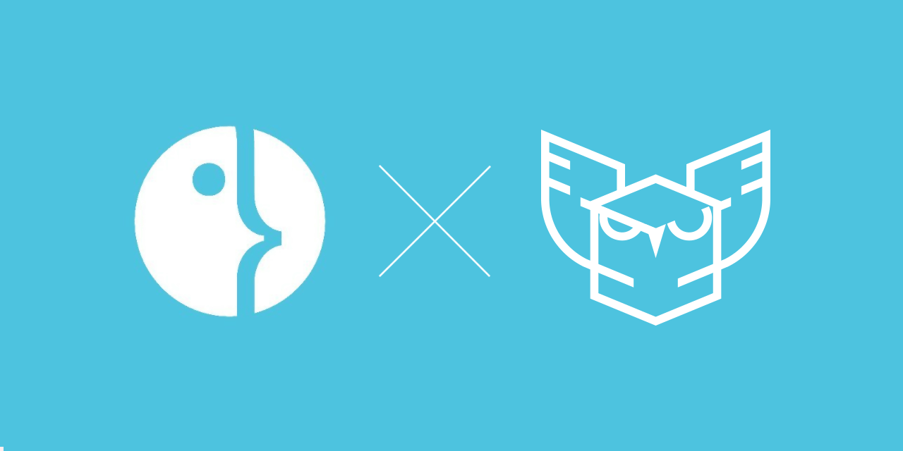
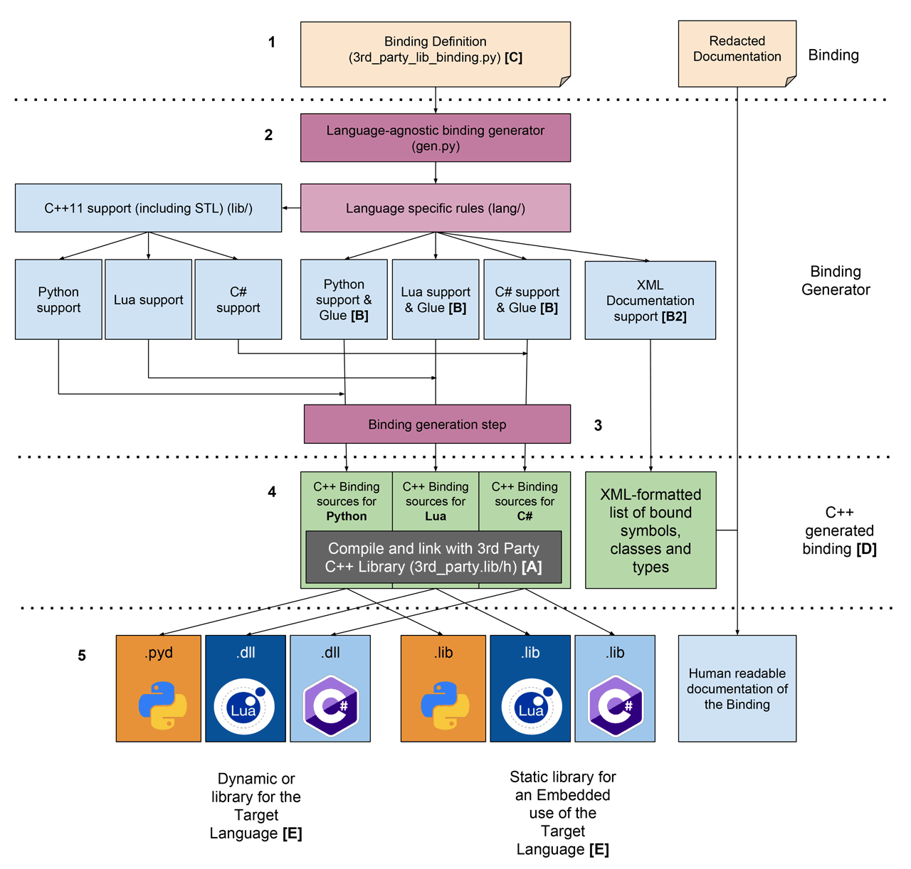

# Adding a language to FabGen

An Algosup x Harfang Project.

#### Table of contents

1. [Overview](#overview)
   - [Supported languages](#supported_languages)
   - [Proposed languages](#proposed_languages)
2. [Writing a binding generator](#writing_a_binding_generator)
   - [C/C++ and dynamically typed languages](#c_and_dynamically_typed_languages)
   - [C/C++ and statically typed languages](#c_and_statically_typed_languages)
3. [FABGen testrun](#fabgen_testrun)
4. [FABGen architecture](#fabgen_architecture)
`
<a name="overview"></a>
## Overview

Fabgen was written for the Harfang 3D project to bring the C++ engine to languages such as Python, Lua and Go. It was written as a replacement for SWIG, a very well-known binding generator supporting a lot of target languages.

SWIG has different issues we wished to address:
- Very old and complex codebase. Language support is written partially in C and SWIG interface files which are almost a language by themselves. The C codebase does everything through a single Object struct hiding the real type of variables making it extremely difficult to debug and extend the SWIG core.
- Uneven feature support between languages with missing features although the target language could support them.

Fabgen tries to solve this issues by:
- Using Python to implement Fabgen and the binding definitions themselves.
- Implementing as much as possible of the features in a common part of the program (gen.py).

As a newer project Fabgen also tries to leverage newer APIs whenever possible for example by supporting CPython limited ABI so that extension modules it generates can be used by any version of CPython >3.2 without recompilation (at least in theory, the Py_LIMITED_API support in CPython is finicky at best).

<a name="supported_languages"></a>
### Supported languages

- Python 3.2+ (CPython)
  - Interpreted bytecode
  - Dynamically typed
  - C API to extend the language with native extension modules (stable ABI since 3.2 through the Py_LIMITED_API macro)
  - C API to create values and call functions
- Lua 5.3+
  - Interpreted bytecode
  - Dynamically typed
  - C API to extend the language with native extensions
  - C API to push values to the VM stack and call functions
- Go 1.11+
  - Compiled
  - Statically typed
  - Link to C library, C++ has to be wrapped with C first (https://stackoverflow.com/questions/1713214/how-to-use-c-in-go)

<a name="proposed_languages"></a>
### Proposed languages

- Rust
  - Compiled
  - Statically typed
  - Link to C library (C++ has to be wrapped with C first)
- F#
  - JIT from IL
  - Statically typed
  - Link to C library (C++ has to be wrapped with C first)

<a name="writing_a_binding_generator"></a>
## Writing a binding generator

You must know C++ and the target language (Python, Lua, Rust, etc...) and its feature set. A deep understanding of those features and inner workings is required to come up with a correct solution. Taking any shortcut is a guaranteed core dump or memory leak on the user side at a later point.

Think of this as designing Jenga blocks: you have no idea how intertwined those pieces will be in the user's program so they must be correct from every possible angle.

<a name="c_and_dynamically_typed_languages"></a>
### C/C++ and dynamically typed languages (eg. Python, Lua, Squirrel)

Dynamically typed languages usually hold values of any type in instances of a polymorphic Object type (eg. PyObject in CPython, stack value in Lua).

For each type it binds, Fabgen creates a minimum of three functions:

- `check`: Test if an object in the target language holds a copy or reference to a C/C++ object of a specific type.
- `to_c`: Returns a reference to the C/C++ object held by an object in the target language.
- `from_c`: Return an object in the target language holding a copy or reference to a C/C++ object.

The exact signature of these functions depends on the target language API. For Lua, which is a stack-based, the functions binding the int type are implemented as follow:

```c
bool hg_lua_check_int(lua_State *L, int idx) {
    return lua_isinteger(L, idx);
}

void hg_lua_to_c_int(lua_State *L, int idx, void *obj) {
    *((int*)obj) = (int)lua_tointeger(L, idx);
}

int hg_lua_from_c_int(lua_State *L, void *obj, OwnershipPolicy) {
    lua_pushinteger(L, *((int*)obj));
    return 1;
}
```

When calling the from_c function for a type, an ownership policy is passed to the wrapper object so that it knows what to do with the underlying native object when the wrapper object is destroyed. There are three possible policies: non-owning, copy and owning.

In existing binding implementations, references to a native object are always stored as a pointer plus a 32 bit unsigned integer type and the ownership policy.

<a name="c_and_statically_typed_languages"></a>
### C/C++ and statically typed languages (eg. Go, C#, Rust)

A compiled statically typed language will almost always support a mechanism to import and call functions from a C-style ABI. Most of the time this will be the only way to call into a different language and the only to write extensions using native code for the target language.

Adding support for such a language in Fabgen can be done using the following strategy:

#### 1. Create a mapping of elementary types

Identify the elementary types common to both languages and create a mapping between them. C types might map to a single or more types in the target language.

#### 2. Implement a C API wrapping the C/C++ objects

Create functions to access object's members of elementary type. Implement a mechanism to access nested objects.

Note that passing C/C++ objects will be done through the use of naked pointers, the target language will however not be able to differentiate object A from object B (as both essentially are void *) so wrapped objects need to include a type tag to catch programming errors such as passing an object of type A to a function expecting an object of type B.

This can be done by using a structure like the following:

```C
struct wrapped_native_obj {
  uint32_t type_tag;
  void *obj;
};
```

The ownership of a wrapped object needs to be stored as well in order to properly handle object destruction. Consider the following scenario:

```C
struct Vec3 {
  float x, y, z;
};

const Vec3 *get_global_vec3();
Vec3 new_vec3(float x, float y, float z);
```

The `get_global_vec3` function returns a pointer to a Vec3 that is owned by the native layer, ownership is not passed to the target language. For small objects it might be justified to force a copy of the returned object to address potential issues with the object lifetime, the target language gets ownership of the returned object. But some native types might too expensive to copy or might simply be non-copyable.

All sorts of strategies can be devised to address complex lifetime issues like the one presented here but selecting the best one to use depends on the native library being wrapped and the target language.

#### 3. Better integration with the target language

While the wrapped API can technically everything we need to use the native library its usage will feel completely foreign to the target language. Let's consider the following sequence of instructions to add two vectors in Python using the wrapped API directly. It might look like this:

```python
a = vec3_new(2, 4, 8)
b = vec3_new(1, 3, 4)

c = vec3_add(a, b)

print(f'x: {vec3_get_x(c)} y: {vec3_get_y(c)} z: {vec3_get_z(c)}')

vec3_delete(a)
vec3_delete(b)
vec3_delete(c)
```

While functional, this code is as far as idiomatic Python as it can be:

- It performs manual memory management
- Objects are accessed through global functions
- Operators are replaced by global function calls

Idiomatic Python might look more like this:

```python
a = vec3(2, 4, 8)
b = vec3(1, 3, 4)

c = a + b

print(f'x: {c.x} y: {c.y} z: {c.z}')
```

Achieving this degree of integration of the native API types with CPython requires the use of PyTypeObject which is exactly what Fabgen does to implement support for operator overload and automatic memory management of native objects.

<a name="fabgen_testrun"></a>
## FABGen testrun

Let's perform a test run of FABGen.

1. Install CPython 3.x
1. Fork the git repository from `https://github.com/ejulien/FABGen.git`
1. Clone it locally
1. Install requirements from the FABGen repository by running `pip install -r requirements.txt`

We'll generate the Lua binding for the following hypothetical API (we're only interested in the generator output at this point):

```C++
class FloatValue {
public:
	FloatValue();
	FloatValue(float value);
	~FloatValue();

	float Get() const;
	void Set(float value);
};

FloatValue operator+(const FloatValue &a, const FloatValue &b);
```

The FABGen script to feed the generator with is written in Python and will look like this:

```python
import lib

def bind(gen):
	gen.start('float_value')

	lib.bind_defaults(gen)  # bind default types (int, float, etc...)

	float_value = gen.begin_class('FloatValue')  # begin type definition
	gen.bind_constructor(float_value, ['?float value'])  # declare constructor

	gen.bind_method(float_value, 'Get', 'float', [])  # declare getter method
	gen.bind_method(float_value, 'Set', 'void', ['float value'])  # declare setter method

	gen.bind_arithmetic_ops_overloads(float_value, ['+'], [('FloatValue', ['const FloatValue &b'], [])])  # bind arithmetic operator

	gen.end_class(float_value)

	gen.finalize()
```

To generate the Lua and CPython bindings for this library run: `{FABGen}\bind.py --lua --cpython --out {FABGen} test_bind.py`

Let's have a look over the generated output!

<a name="fabgen_architecture"></a>
## FABGen architecture


